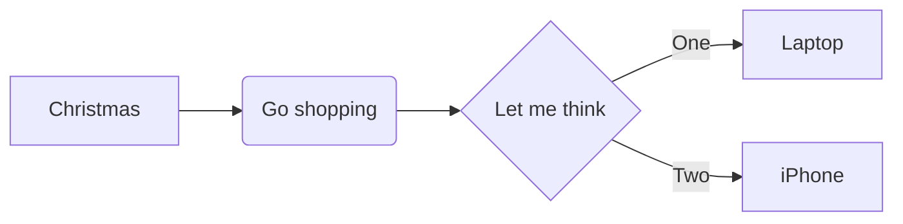
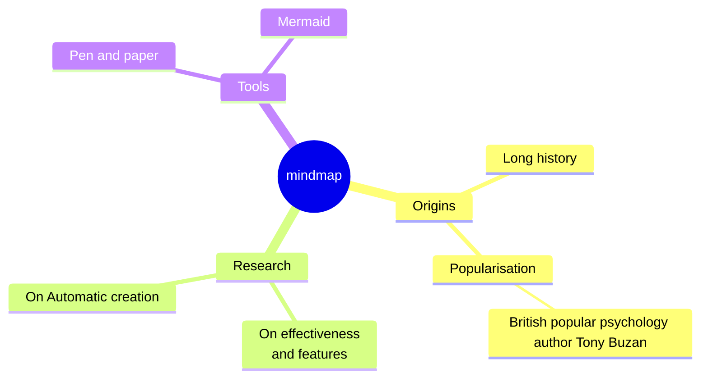

# Markdown cheat sheet
- See: [GitHub - Basic writing and formatting syntax](https://docs.github.com/en/get-started/writing-on-github/getting-started-with-writing-and-formatting-on-github/basic-writing-and-formatting-syntax)

## Math 
``` Inline math: $`\sqrt{3x-1}+(1+x)^2`$ ```

This sentence uses delimiters to show math inline: $`\sqrt{3x-1}+(1+x)^2`$

**The Cauchy-Schwarz Inequality**
```
'''math
\left( \sum_{k=1}^n a_k b_k \right)^2 \leq \left( \sum_{k=1}^n a_k^2 \right) \left( \sum_{k=1}^n b_k^2 \right)
'''
```

```math
\left( \sum_{k=1}^n a_k b_k \right)^2 \leq \left( \sum_{k=1}^n a_k^2 \right) \left( \sum_{k=1}^n b_k^2 \right)
```

## Diagram support using mermaid

### Flowchart
```
'''mermaid
flowchart LR
    A[Christmas] --> B(Go shopping)
    B --> C{Let me think}
    C -->|One| D[Laptop]
    C -->|Two| E[iPhone]
'''
```


### Mindmap

